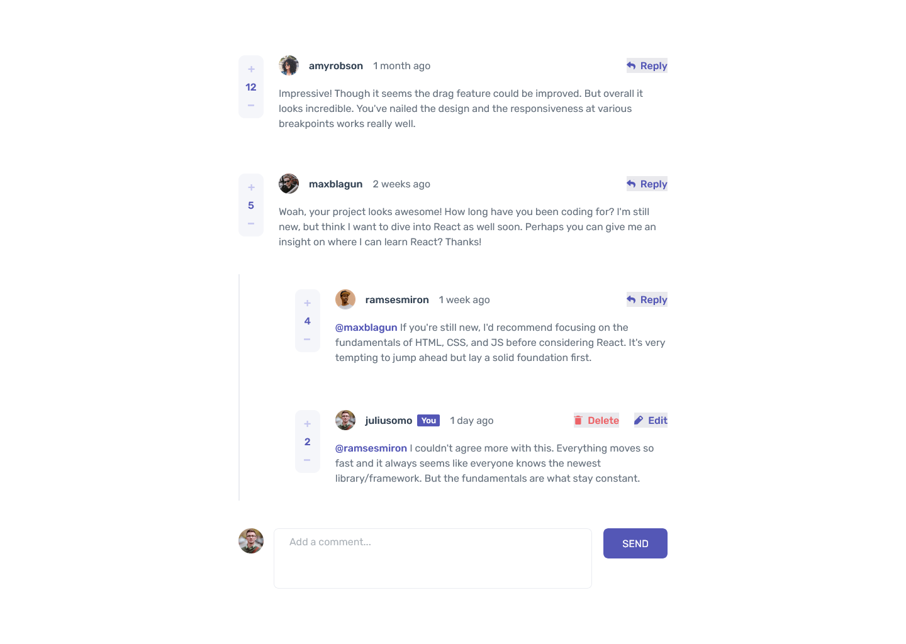

# Frontend Mentor - Interactive comments section solution

This is a solution to the [Interactive comments section challenge on Frontend Mentor](https://www.frontendmentor.io/challenges/interactive-comments-section-iG1RugEG9). Frontend Mentor challenges help you improve your coding skills by building realistic projects. 

## Table of contents

- [Overview](#overview)
  - [The challenge](#the-challenge)
  - [Screenshot](#screenshot)
  - [Links](#links)
- [My process](#my-process)
  - [Built with](#built-with)
  - [What I learned](#what-i-learned)
  - [Continued development](#continued-development)
  - [Useful resources](#useful-resources)
- [Author](#author)
- [Acknowledgments](#acknowledgments)

## Overview

### The challenge

Users should be able to:

- View the optimal layout for the app depending on their device's screen size
- See hover states for all interactive elements on the page
- Create, Read, Update, and Delete comments and replies
- Upvote and downvote comments
- **Bonus**: If you're building a purely front-end project, use `localStorage` to save the current state in the browser that persists when the browser is refreshed.
- **Bonus**: Instead of using the `createdAt` strings from the `data.json` file, try using timestamps and dynamically track the time since the comment or reply was posted.

### Screenshot



### Links

- Solution URL: [https://github.com/keeplearning211/FE_MENTOR-interactive-comments-section](https://github.com/keeplearning211/FE_MENTOR-interactive-comments-section)
- Live Site URL: [https://keeplearning211.github.io/FE_MENTOR-interactive-comments-section](https://keeplearning211.github.io/FE_MENTOR-interactive-comments-section/)

## My process

### Built with

- CSS custom properties
- Flexbox
- CSS Grid
- Mobile-first workflow
- [TypeScript](https://www.typescriptlang.org/) - A superset of JavaScript that adds static types.
- [React](https://reactjs.org/) - JS library for building user interfaces
- [date-fns](https://date-fns.org/) - JS library for manipulating dates and times
- [use-immer](https://github.com/immerjs/use-immer) - JS library for working with immutable state in React
- [less](https://lesscss.org/) - CSS pre-processor for enhancing the functionality of CSS
- [Vite](https://vitejs.dev/) - Build tool for faster and leaner development

### What I learned

I made use of 'grid-template-areas' in CSS Grid to flexibly modify the layout of different elements. In response to any state changes in a component, I ensured to update the class of the relevant element accordingly

```less
.comment {
      grid-template-areas:
        'score author action'
        'score content content';
      &.has-replies {
        grid-template-areas:
          'score author action'
          'score content content'
          'reply reply reply';

        &.replying {
          grid-template-areas:
            'score author action'
            'score content content'
            'reply reply reply'
            'replying replying replying';
        }
      }

      &.replying {
        grid-template-areas:
          'score author action'
          'score content content'
          'replying replying replying';
      }

      &.updating {
        grid-template-areas:
          'score author action'
          'score content content'
          'update update update';
      }
...
}

``````

## Author

This project was created by [keeplearning211](https://www.frontendmentor.io/profile/keeplearning211), a dedicated developer and participant in the Frontend Mentor challenges.
## Acknowledgments

I would like to express my gratitude to:

- The [React documentation on useReducer](https://react.dev/reference/react/useReducer), which greatly aided my understanding and implementation of state management in my React components.
- [TypeScript](https://www.typescriptlang.org/), a superset of JavaScript that adds static types, for enhancing the reliability of my code.
- [React](https://reactjs.org/), a JS library for building user interfaces, for providing the foundation of my application.
- [date-fns](https://date-fns.org/), a JS library for manipulating dates and times, for simplifying date/time handling in my project.
- [use-immer](https://github.com/immerjs/use-immer), a JS library for working with immutable state in React, for making state management more efficient.
- [less](https://lesscss.org/), a CSS pre-processor, for enhancing the functionality of my stylesheets.
- [Vite](https://vitejs.dev/), a build tool, for speeding up the development process.